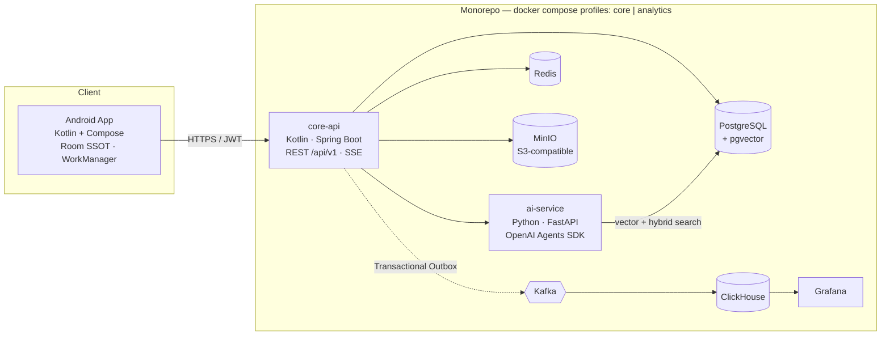

<div align="center">

# 🎓 CampusUTE

**AI-Powered Smart Digital Campus Platform — HCMUTE**

Kotlin · Jetpack Compose · Spring Boot · FastAPI + OpenAI Agents SDK · RAG · pgvector · Offline-First

[](./.github/workflows/repo-guard.yml)
[](../../releases)
[](LICENSE)
[](#getting-started)

</div>

> 🚧 **Status: Foundation phase.** Architecture and roadmap are complete (see
> [Plan overview](docs/architecture/system-overview.md)); implementation lands
> phase by phase — this README is updated honestly at each milestone
> (DONE/PLANNED, no fake completeness).

## ✨ What is CampusUTE?

One app for nearly everything a HCMUTE student does on campus — backed by a
production-minded platform:

- 📅 **Offline-first timetable & exam schedule** — Room DB is the single source
  of truth; works in elevators, weak Wi-Fi, backend outages.
- 🤖 **Agentic AI Campus Assistant** — router + 8 specialist agents, tool
  calling re-verified by the backend (LLM is *never* the security boundary),
  RAG over university regulations with **mandatory citations** (document,
  page, excerpt).
- 🧠 **Smart Study Planner, Notes + AI** (summarize / flashcards / quiz —
  propose-only, user confirms).
- ✅ **Secure QR attendance** — short-lived rotating tokens signed server-side,
  anti-replay nonce; nothing trusted from the client.
- 📊 **Event-driven analytics** — Transactional Outbox → Kafka → ClickHouse
  (optional `analytics` compose profile; core runs fine without it).
- 🔐 **RBAC (6 roles) + ABAC**, JWT with refresh rotation, Argon2, audit logs,
  rate limiting, threat model documented.

## 🏗 Architecture (system context)



Deep dives: [system-overview](docs/architecture/system-overview.md) ·
[Android architecture](docs/architecture/android-architecture.md) ·
[Backend architecture](docs/architecture/backend-architecture.md) ·
[RAG](docs/ai/rag-architecture.md) · [Agents](docs/ai/agent-architecture.md) ·
[Threat model](docs/security/threat-model.md) ·
[ADRs](docs/adr/) · [Database](docs/database/database-design.md)

## 📁 Project structure

```
CampusUTE_Kotlin_Project/
├── apps/android/          # Kotlin + Compose app (multi-module, offline-first)
├── backend/               # Kotlin Spring Boot modular monolith (/api/v1)
├── ai-service/            # Python FastAPI + OpenAI Agents SDK (RAG, tools)
├── packages/api-contracts/  # Frozen OpenAPI snapshot shared by 3 codebases
├── deploy/                # docker-compose (profiles: core | analytics)
├── database/              # migrations are in backend (Flyway); seeds & diagrams
├── docs/                  # architecture, ai, security, adr, demo
├── assets/                # demo GIF, diagrams, screenshots (regenerable)
├── scripts/               # dev scripts (secret-scan, seed, demo, diagrams)
└── .github/workflows/     # repo-guard CI, android/backend/ai CI, release
```

## 🚀 Getting started

Prerequisites: **Docker**, **JDK 17/21/24** (Gradle 8.14 — *not* JDK 26),
**Android Studio** (SDK 34+).

```bash
git clone https://github.com/JasonTM17/CampusUTE_Kotlin_Project.git
cd CampusUTE_Kotlin_Project
cp .env.example .env                 # fill in only what you need; never commit it
docker compose --profile core up -d  # postgres+pgvector, redis, minio, backend, ai
```

- Backend API: http://localhost:8080/swagger-ui (OpenAPI: `/v3/api-docs`)
- AI service health: http://localhost:8600/health
- Android: open `apps/android` in Android Studio → run `app` (demo accounts in
  `README` demo section once Phase 1 lands; dev-only, disabled in release).

> AI works out of the box in **mock/replay mode** (no API key needed). Set
> `OPENAI_API_KEY` in `.env` to enable live models — the key never enters the
> APK.

## 🗺 Roadmap

| Phase | Scope | Status |
|---|---|---|
| 0 | Environment gate, bootstrap, CI guard | ✅ DONE |
| 1 | Backend platform + Android core + **contract freeze** | ✅ DONE |
| 2 | Vertical slice: Student Schedule E2E (offline) | ✅ DONE |
| 3 | Generic sync engine (delta, pending queue, optimistic) | PLANNED |
| 4 | Academic core (assignment, grade/GPA, QR attendance, events) | PLANNED |
| 5 | AI core: agents + RAG + citations | PLANNED |
| 6 | 8 agents + eval harness + notes AI | PLANNED |
| 7 | Secondary modules + Kafka/ClickHouse analytics | PLANNED |
| 8 | Hardening, docs, demo GIF, release v1.0.0 | PLANNED |

## 🔐 Security & privacy

- No real HCMUTE personal data — all seed data is synthetic. University SSO is
  an adapter interface (`UniversitySSOAuthProvider`), not a fake integration.
- Secrets live in `.env` (git-ignored) / Android Keystore — never in the repo
  or the APK; CI runs a secret scan on every push.
- The AI layer treats retrieved documents as **untrusted data** (prompt
  injection defense) and filters retrieval by permission **before** the LLM
  sees any context. See the [threat model](docs/security/threat-model.md).

## 🤝 Contributing

Course project — single mainline. Conventional Commits only; every commit must
build; push after each milestone; `plans/` and secrets are never committed.

## 📄 License

[MIT](LICENSE)
