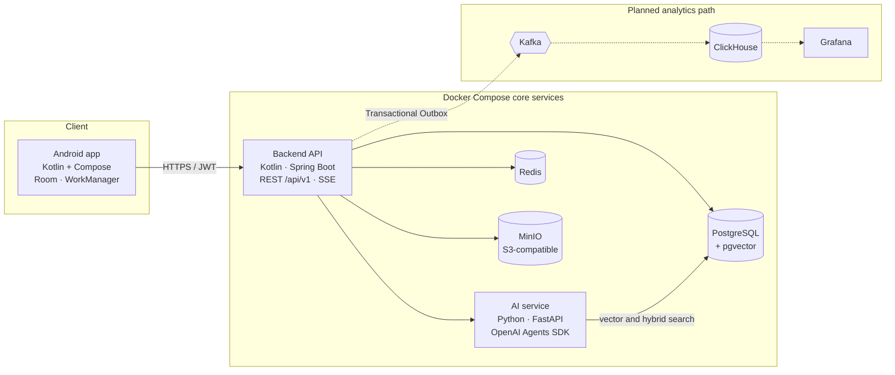
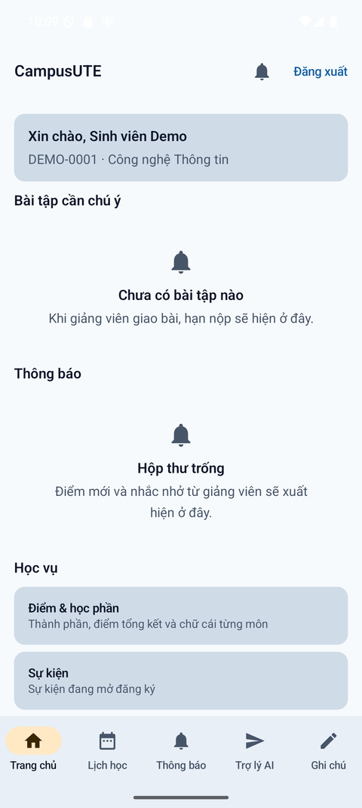
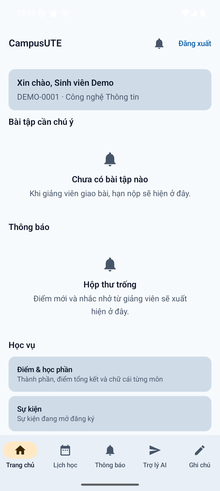
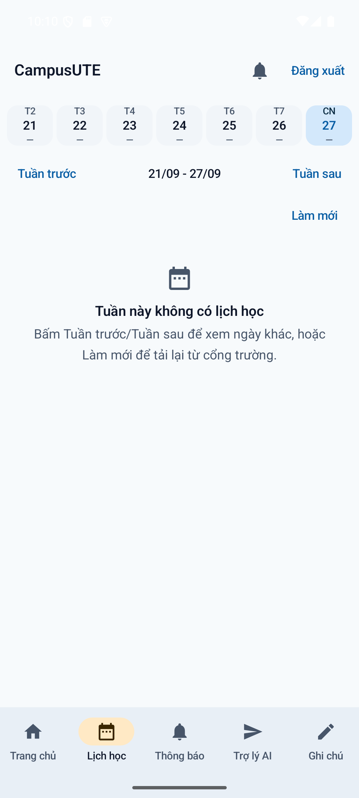
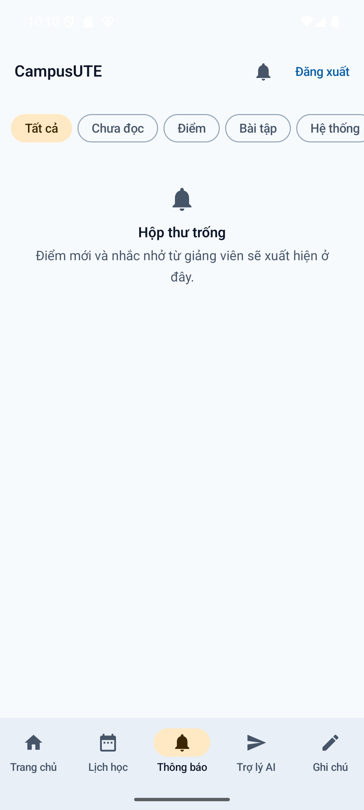
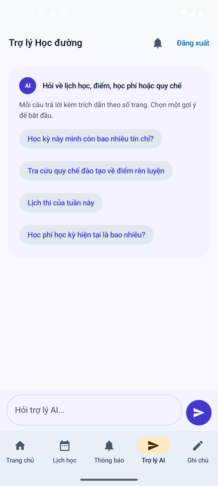

# CampusUTE

**Student services for HCMUTE, with an offline-ready timetable**

**Technology:** Kotlin, Jetpack Compose, Spring Boot, FastAPI, OpenAI Agents
SDK, PostgreSQL, pgvector, and Redis.

[Android release v1.1.0](https://github.com/JasonTM17/CampusUTE_Kotlin_Project/releases/tag/v1.1.0) ·
[All releases](https://github.com/JasonTM17/CampusUTE_Kotlin_Project/releases) ·
[GitHub Packages](https://github.com/JasonTM17/CampusUTE_Kotlin_Project/pkgs) ·
[Container deployment](docs/deployment/container-images.md) ·
[CI workflow](.github/workflows/repo-guard.yml) ·
[MIT License](LICENSE)

> **Release status:** The Android application and GitHub release are at
> `v1.1.0`. The backend-only container patch is `v1.1.1`; the AI container
> remains at `v1.1.0`.

## Overview

CampusUTE combines an Android application with services for academic
scheduling, campus information, and student support. The published Android
release includes an offline-ready timetable backed by locally saved schedule
data.

- **Timetable:** Saved schedule data is available from the local Room database
  when the device is offline.
- **Campus assistant:** Routes questions across university information and can
  retrieve regulation material with source citations. The backend enforces
  access to personal data.
- **Notes:** Notes are remote-first. AI summaries are proposals that users can
  accept or dismiss before changing a note.
- **Service security:** The backend applies role- and attribute-based access
  control, refresh-token rotation, password hashing, and audit logging.

## Architecture


```mermaid
flowchart LR
    subgraph Client
        A["Android app<br/>Kotlin + Compose<br/>Room · WorkManager"]
    end
    subgraph Platform["Docker Compose core services"]
        B["Backend API<br/>Kotlin · Spring Boot<br/>REST /api/v1 · SSE"]
        C["AI service<br/>Python · FastAPI<br/>OpenAI Agents SDK"]
        D[("PostgreSQL<br/>+ pgvector")]
        E[("Redis")]
        F[("MinIO<br/>S3-compatible")]
    end
    subgraph OptionalAnalytics["Planned analytics path"]
        G{{Kafka}} -.-> H[("ClickHouse")] -.-> I[Grafana]
    end
    A -->|"HTTPS / JWT"| B
    B --> C
    B --> D
    B --> E
    C -->|"vector and hybrid search"| D
    B --> F
    B -.->|"Transactional Outbox"| G
```

The analytics components are planned and are not required by the core stack.
Read the [system overview](docs/architecture/system-overview.md),
[Android architecture](docs/architecture/android-architecture.md),
[backend architecture](docs/architecture/backend-architecture.md),
[RAG design](docs/ai/rag-architecture.md),
[agent design](docs/ai/agent-architecture.md),
[chat design contract](docs/ai/chat-design.md),
[app screen catalogue](docs/ai/app-design.md),
[security threat model](docs/security/threat-model.md),
[database design](docs/database/database-design.md), and
[architecture decisions](docs/adr/) for details.

## Repository guide

| Path | Purpose |
|---|---|
| [`apps/android`](apps/android/) | Kotlin and Jetpack Compose application |
| [`backend`](backend/) | Spring Boot API and academic services |
| [`ai-service`](ai-service/) | FastAPI assistant, retrieval, and tools |
| [`packages/api-contracts`](packages/api-contracts/) | Shared API contract snapshots |
| [`deploy`](deploy/) | Published-image Compose configuration |
| [`docs`](docs/) | Architecture, AI, security, database, and deployment guides |
| [`.github/workflows`](.github/workflows/) | CI and release workflows |

## Getting started

### Prerequisites

- Docker Engine with Docker Compose
- JDK 17, 21, or 24
- Android Studio with Android SDK 34 or later

Clone the repository and create a local environment file from the example.

```bash
git clone https://github.com/JasonTM17/CampusUTE_Kotlin_Project.git
cd CampusUTE_Kotlin_Project
cp .env.example .env
```

In PowerShell, use `Copy-Item .env.example .env` for the copy step. Set only
the environment values required for the services you intend to run, then start
the development stack:

```bash
docker compose up -d
```

- Backend API and OpenAPI UI: `http://localhost:8080/swagger-ui`
- AI service health: `http://localhost:8600/health`
- Android app: open `apps/android` in Android Studio and run the `app`
  configuration.

For synthetic local demo identities, explicitly set `APP_DEMO_MODE=true` in
your local environment. Published-image configuration keeps demo seeding off
by default. The AI service starts in mock/replay mode; set `OPENAI_API_KEY` in
the local `.env` file to use live models. Never put the key in the APK or commit
the `.env` file.

## Published container images

The backend `v1.1.1` image and its `latest` alias resolve to the same verified
manifest digest in Docker Hub and GitHub Container Registry (GHCR). The AI
image remains at `v1.1.0`. Use the [container deployment guide](docs/deployment/container-images.md)
for pinned pull commands, registry Compose setup, and image metadata.

| Service and tags | Docker Hub | GitHub Packages | Manifest digest |
|---|---|---|---|
| Backend `v1.1.1`, `latest` | [campusute-backend](https://hub.docker.com/r/nguyenson1710/campusute-backend) | [campusute-backend](https://github.com/JasonTM17/CampusUTE_Kotlin_Project/pkgs/container/campusute-backend) | `sha256:74c38334e8a9e23c1ef8cfcf247cfb798a1e5fb3486ac69bcb75e25e591213c4` |
| AI service `v1.1.0`, `latest` | [campusute-ai](https://hub.docker.com/r/nguyenson1710/campusute-ai) | [campusute-ai](https://github.com/JasonTM17/CampusUTE_Kotlin_Project/pkgs/container/campusute-ai) | `sha256:2cecfa4efd800ca9c5da04af373ba104b5e9865b9cc481c2233247209bbe5d6b` |

## App screenshots and GIF

The following media was captured from the published `v1.1.0` APK on an isolated
API 35 emulator on 2026-09-27. The home screen uses a generic synthetic demo
identity. The timetable and notifications show empty states. The AI screen
shows prompt suggestions, not a generated answer.



| Home dashboard | Weekly timetable |
|---|---|
|  |  |

| Notifications | AI assistant |
|---|---|
|  |  |

The [design catalogue](assets/design/README.md) contains the Stitch design
references and screen-state notes.

## Security and privacy

- Seed data is synthetic. Do not use demo identities in a shared or production
  environment.
- Keep local credentials in `.env` or the Android Keystore. The repository
  includes a secret scan in CI; see the [repository publication guide](docs/security/repository-publication.md)
  for the public-tree and scanner limits.
- Local agent tools, session data, and `plans/` are ignored by Git. Required
  workflows remain under `.github/workflows/`.
- Retrieved documents are treated as untrusted input. See the
  [security threat model](docs/security/threat-model.md) for the documented
  prompt-injection and authorization boundaries.

## Contributing

CampusUTE is a course project. Use Conventional Commits and keep changes scoped
to the feature being updated. Do not commit credentials, generated local state,
or private agent-tool directories.

## License

Released under the [MIT License](LICENSE).
